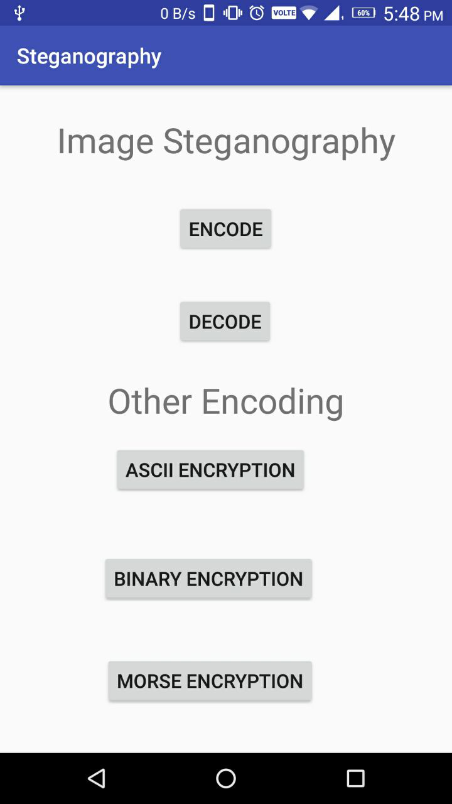

<div id="top"></div>

<!-- PROJECT LOGO -->
<br />
<div align="center">
  <a href="https://github.com/github_username/repo_name">
    
  </a>

<h3 align="center">Android Stenography</h3>

  <p align="center">
    Hide text in Images
  </p>
</div>


<!-- ABOUT THE PROJECT -->
## About The Project

[](https://example.com)

Stenography Android App : To hide text inside any Image


### Built With

* [Andriod Studio]
* [Java]


<!-- GETTING STARTED -->
## Getting Started

This is an example of how you may give instructions on setting up your project locally.
To get a local copy up and running follow these simple example steps.

### Prerequisites

* Android Studio Latest
* JDK 8+

### Installation

2. Clone the repo
   ```sh
   git clone https://github.com/shubd-dev/image-steganography-mini-proj.git
   ```
3. Build App
4. Run App

<!-- USAGE EXAMPLES -->


<!-- ROADMAP -->
## Roadmap

- [ ] ASCII Encode


<p align="right">(<a href="#top">back to top</a>)</p>


<!-- CONTRIBUTING -->
## Contributing

Contributions are what make the open source community such an amazing place to learn, inspire, and create. Any contributions you make are **greatly appreciated**.

If you have a suggestion that would make this better, please fork the repo and create a pull request. You can also simply open an issue with the tag "enhancement".
Don't forget to give the project a star! Thanks again!

1. Fork the Project
2. Create your Feature Branch (`git checkout -b feature/AmazingFeature`)
3. Commit your Changes (`git commit -m 'Add some AmazingFeature'`)
4. Push to the Branch (`git push origin feature/AmazingFeature`)
5. Open a Pull Request

<!-- CONTACT -->
## Contact

Name - Shubham Dhumale - shubhamdhumale@gmail.com
Name - Abhishek Badmore

